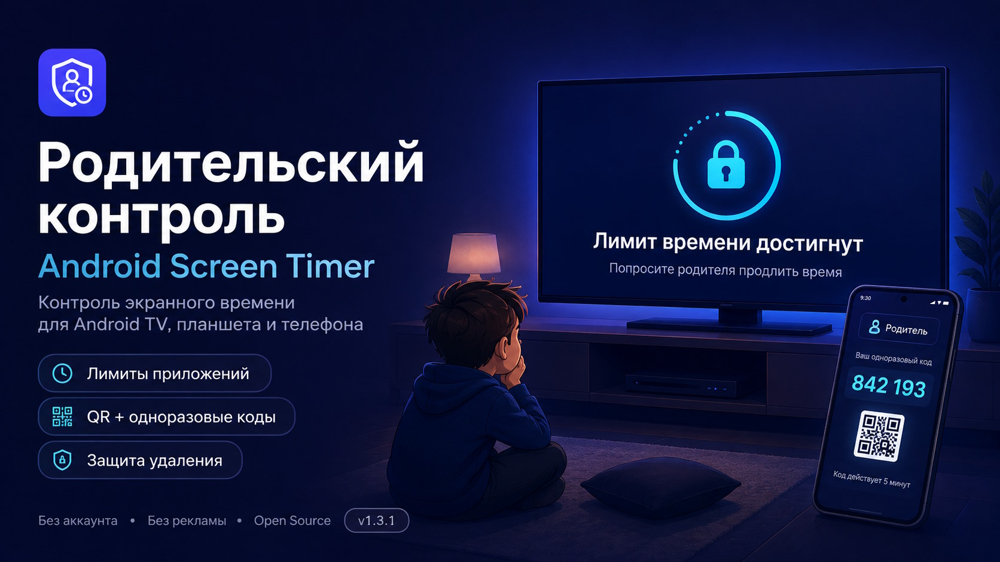

# ⏱️ Parental Control — Android Screen Timer

### TV, tablet, or phone — family screen time under control.

**Free family screen-time control for Android** 
with parent codes, viewing reminders, per-app limits, discreet launcher profiles, and uninstall protection.

[**⬇️ Download the APK**](https://github.com/alexaistudio/parental-control-android-screen-timer/releases/latest) ·
[Maximum uninstall protection](docs/GUIDE.en.md#maximum-uninstall-protection-device-owner) ·
[💚 Support development](#support-development) ·
[🇷🇺 Русский README](README.md)

---

## Your child lost track of time? The timer will not.

Choose how long your child can watch or play. The app shows the time left, offers break reminders, and blocks selected apps when time runs out. A new day brings a fresh allowance, using the device's local date.

## Features at a glance

- ⏱️ **Daily time limits** — for the whole device or just selected apps.
- ➕ **Extra time with a parent's permission** — from 10 minutes to 2 hours.
- 🔐 **Codes from a parent's phone** — valid for up to 5 minutes, with time to enter them using a remote. A permanent backup PIN is available too.
- 🔔 **Break reminders** — every 10, 20, or 30 minutes.
- 👨‍👩‍👧‍👦 **Support for several parents** — add their phones using the QR code in settings.
- 🥷 **Ten names and icons** — choose a discreet launcher appearance, such as Clock or Calculator.
- 🛡️ **Parent-code protection for settings** — switch it off if your family prefers open access.

For **Android 6.0 and newer**: TVs, tablets, and phones. Use a remote or touchscreen. Russian and English interfaces. No ads, accounts, or cloud service.

## Download and get started

The [latest release](https://github.com/alexaistudio/parental-control-android-screen-timer/releases/latest) includes two APKs. Choose the one you need:

| Where it goes | File to download |
| --- | --- |
| Your child's TV, tablet, or phone | **AndroidScreenTimer-1.4.9.apk** — the screen-time limiter |
| A parent's Android phone, to install the limiter on another device | **AndroidScreenTimer-Parent-1.4.9.apk** — the installer with the limiter included |

**Install directly:** put the limiter on your child's device, open it, and complete setup:

1. Scan its QR code on a parent's phone using an authenticator app, such as Google Authenticator or Aegis.
2. Set a backup PIN, daily allowance, and the apps to control.
3. Enable the control service in Android Accessibility settings, then check its status in the app.

**Install from a parent's phone:** Parent Installer helps transfer the app to another device over Wi-Fi. Debugging must first be enabled on the receiving device. This is not one-tap installation on every TV: connection support depends on its firmware.

[📖 Step-by-step installation: Wi-Fi or direct](docs/GUIDE.en.md#installation)

## Good to know

- **Opened protected settings by mistake?** Press Back or the on-screen Home button on the code prompt. No PIN is needed to leave.
- **Disguise is not invisibility.** It changes the launcher name and icon, not the entry in Android's system app list.
- **Uninstall protection depends on Android.** A system-level uninstall block requires the additional Device Owner mode. [Setup instructions](docs/GUIDE.en.md#maximum-uninstall-protection-device-owner).
- **Keep your backup and emergency codes safe.** An ordinary USB drive or charger does not unlock the device. Recovery through a special file on a drive can be disabled.

## Guides and help

- [Detailed settings, recovery, and limitations](docs/GUIDE.en.md)
- [Control service will not enable? Check the installation guide](docs/GUIDE.en.md#option-2--install-the-apk-directly)
- [Report a problem](https://github.com/alexaistudio/parental-control-android-screen-timer/issues) — include your device model and app version. Parent Installer logs can be copied or saved as TXT; TV logs can be transferred using QR codes. Review logs before posting: they may contain local IP addresses and device details.
- [Release history](CHANGELOG.md)
- For developers: [building](docs/GUIDE.en.md#building) · [architecture](docs/ARCHITECTURE.md) · [data and permissions](docs/GUIDE.en.md#data-and-permissions)

## Support development

Android Screen Timer stays free for personal and family use. If it helps your family, you can voluntarily support development with **USDT TRC-20**.

**Network:** TRON 
**Address:** `TMoM4t1JsevXo42cRBiYue51NXrsjuGhqd`

  

The QR code contains only the address shown above. Before sending, make sure the wallet network is **TRON (TRC-20)**.

## License

Android Screen Timer is free for unmodified personal, family, and other noncommercial use under the [PolyForm Strict License 1.0.0](LICENSE.md). Commercial use, modified redistribution, and derivative works require separate written permission. The license text takes precedence over this summary.

Notices and licenses for the mobile ADB installer's libraries are listed in [THIRD_PARTY_NOTICES.md](THIRD_PARTY_NOTICES.md).
